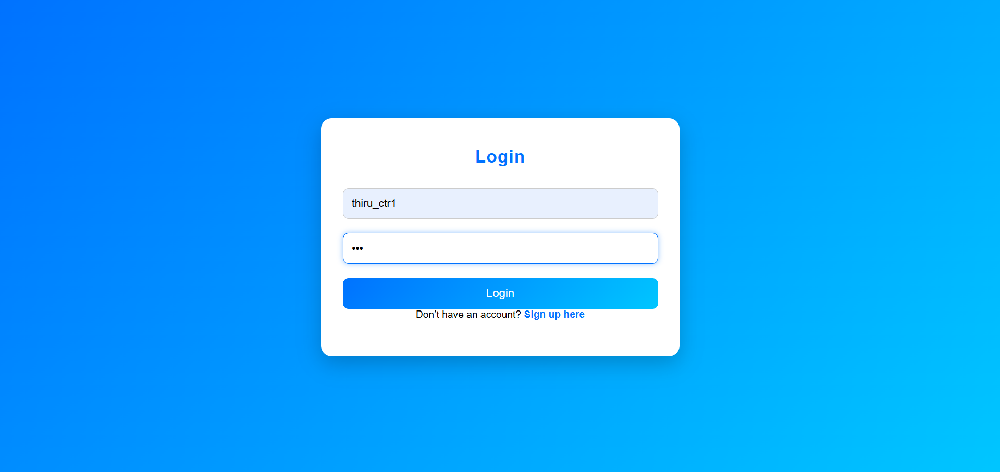
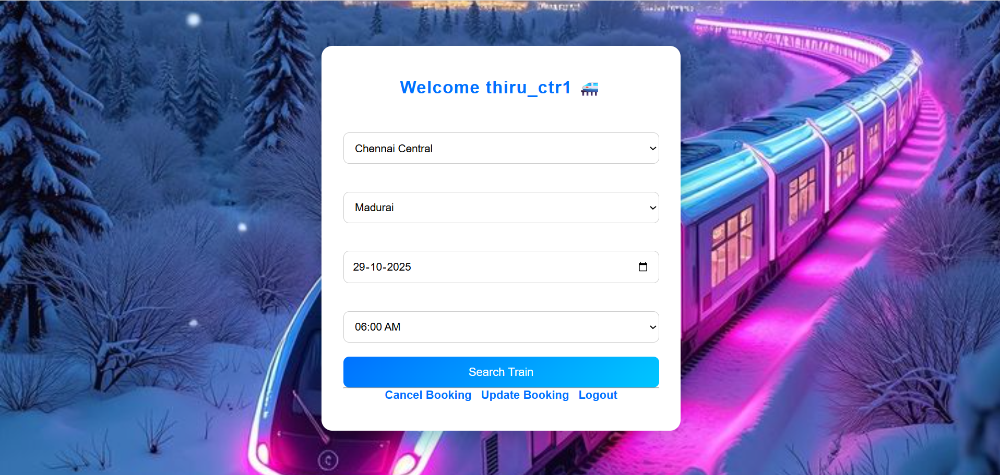
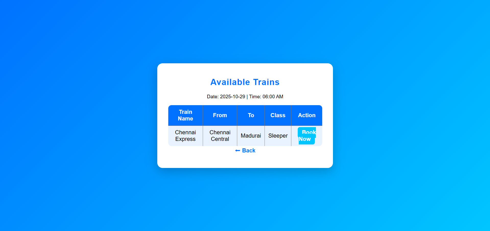
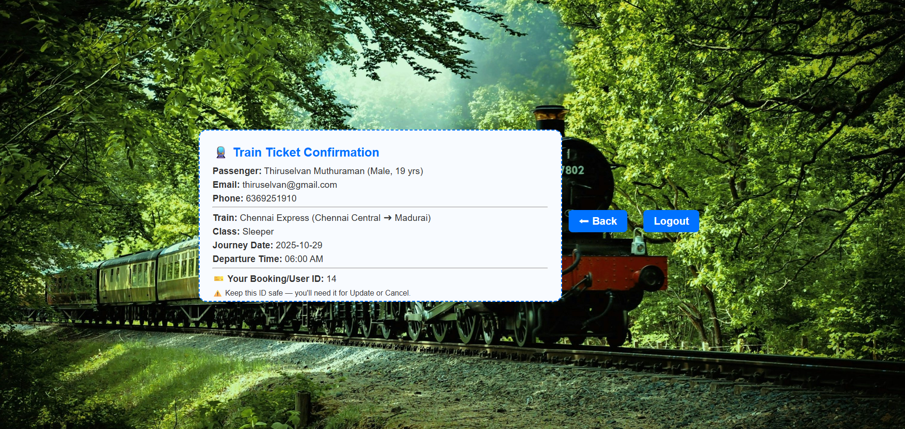

# 🚄 Train Ticket Booking System

A Flask-based web application for booking train tickets with full MySQL database integration.
Users can sign up, log in, search for trains, book tickets, update bookings, and cancel tickets easily.

---

## 🧩 Features

 - 👤 User Authentication – Secure login and signup system

 - 🔍 Train Search – Find available trains between selected stations

 - 🎫 Ticket Booking – Book tickets with passenger details and class selection

 - ✏️ Update Booking – Modify ticket details like class type

 - ❌ Cancel Booking – Cancel booked tickets easily

 - 🧾 Booking Confirmation – View ticket details after successful booking

 - 🎨 Attractive UI – Styled with CSS and background images for better user experience

 ---

 ## ⚙️ Tech Stack
 ```bash
    Category  |	 Technologies Used
    Backend	 |   Flask (Python)
    Database  |	 MySQL
    Frontend  |	 HTML, CSS
    Server	 |   Flask Development Server
``` 

---

## 📂 Project Structure
```bash
Train-Ticket-booking/
│
├── static/
│   ├── style.css          # Styling for all pages
│   └── demo.js            # JS file for interactivity and UI enhancements
│
├── templates/
│   ├── base.html          # Search trains page
│   ├── login.html         # Login page
│   ├── signup.html        # Signup page
│   ├── train.html         # Train results page
│   ├── ticket.html        # Ticket booking form
│   ├── book.html          # Booking confirmation page
│   ├── update.html        # Update ticket page
│   └── cancel.html        # Cancel ticket page
│
├── app.py                 # Flask main application file
└── README.md              # Project documentation
```

---

## 🛠️ Setup Instructions

### Clone this repository:
```bash
git clone https://github.com/thiruselvan-mle/Train-Ticket-Booking.git
cd train-ticket-booking
```

### Create and activate virtual environment:
```bash
python -m venv venv
venv\Scripts\activate
```

### Install dependencies:
```bash
pip install flask mysql-connector-python
```

### Update MySQL credentials in app.py:
```bash
conn = mysql.connector.connect(
    host="your_host",
    user="your_user",
    password="your_password",
    database="your_database",
    port="your_port"
)
```

### Run the app:
```bash
flask run
```

### Open in your browser →🔗 http://127.0.0.1:5000

---

## 📸 Screenshots

 - Login Page
 

 - Train Search -adding soon
 

 - Ticket Booking -adding soon
 

 - Confirmation Page -adding soon
 